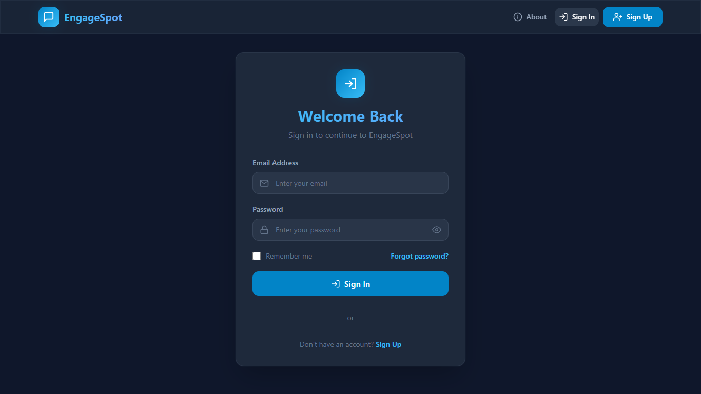
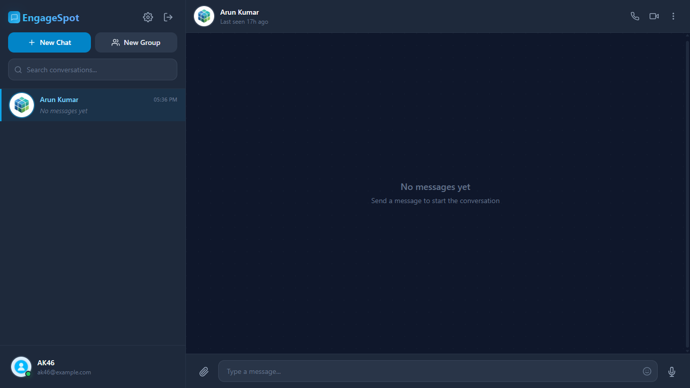
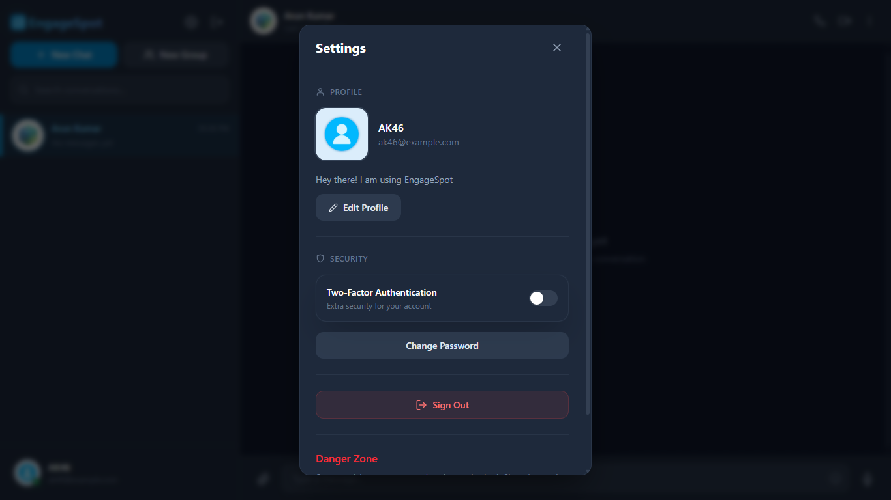

# 💬 EngageSpot - Real-time MERN Chat Application


**EngageSpot** is a modern, fully responsive, and feature-rich real-time messaging platform built using the **MERN Stack** (MongoDB, Express.js, React, Node.js) and **Socket.IO**. It offers seamless communication with features like one-on-one chats, group conversations, media sharing, typing indicators, and robust security.

---

## 📑 Table of Contents

- [About The Project](#about-the-project)
- [Features](#features)
- [Tech Stack](#tech-stack)
- [Screenshots](#screenshots)
- [Project Structure](#project-structure)
- [Installation & Setup Guide](#installation-setup-guide)
  - [Prerequisites](#prerequisites)
  - [Clone the Repository](#clone-the-repository)
  - [Backend Configuration](#backend-configuration)
  - [Frontend Configuration](#frontend-configuration)
- [Contributors](#contributors)
- [License](#license)
- [Contact & Support](#contact-support)

---

## <a id="about-the-project"></a> 📖 About The Project


---

### Overview

**EngageSpot** is a modern, fully responsive, real-time messaging platform 
built using the **MERN Stack** (MongoDB, Express.js, React.js, Node.js) and 
**Socket.IO**. It provides a seamless and secure communication experience 
with features comparable to production-grade messaging applications.

> 💬 *"Connect Instantly. Communicate Securely."*

---

### Problem Statement

In today's connected world, users need messaging platforms that are:
- ⚡ **Fast** — Messages should arrive instantly
- 🔐 **Secure** — Data should be protected at all levels
- 📱 **Responsive** — Work perfectly on any device
- 🎨 **Intuitive** — Easy to use with a clean interface

Many existing solutions either lack real-time capabilities, have 
security vulnerabilities, or provide poor user experiences on 
mobile devices.

---

### Solution

EngageSpot addresses all these challenges by combining:

| Need | Solution |
|------|----------|
| Real-time delivery | Socket.IO WebSocket connections |
| Security | JWT + 2FA + Bcrypt + Helmet + Rate Limiting |
| Responsive design | Tailwind CSS with mobile-first approach |
| Media sharing | Cloudinary cloud storage + Multer |
| Group collaboration | Group chats with admin management |
| Modern UI/UX | Dark-themed design with smooth animations |

---

### Key Capabilities

- 💬 **Real-time Messaging** — Instant message delivery via WebSockets
- ⌨️ **Typing Indicators** — See when someone is typing
- ✅ **Read Receipts** — Know when messages are seen
- 👥 **Group Chats** — Create groups, manage members & roles
- 📎 **Media Sharing** — Send images, videos, and audio files
- 🎙️ **Voice Messages** — Record and send audio notes
- 🔐 **Secure Authentication** — JWT tokens with optional 2FA (Email OTP)
- 🔑 **Password Recovery** — Forgot password with secure email links
- 👤 **Profile Management** — Update avatar, name, password
- 🗑️ **Account Deletion** — Permanently delete account and data
- 🔍 **User Search** — Find users and start conversations
- 🔔 **Notifications** — Real-time toast alerts for new messages
- 🌙 **Dark Mode** — Sleek dark-themed UI
- 📱 **Fully Responsive** — Optimized for Desktop, Tablet & Mobile

---

### Built With

<p>
  
  
  
  
  
  
  
  
  
</p>

---

## <a id="features"></a> 🚀 Features

EngageSpot comes packed with a wide range of features designed to 
deliver a seamless real-time communication experience.

---

### 💬 Real-time Messaging

- ⚡ **Instant Delivery** → Messages arrive instantly via Socket.IO
- ⌨️ **Typing Indicators** → See when someone is typing in real-time
- ✅ **Read Receipts** → Know when your message is delivered & seen
- 🔔 **Notifications** → Real-time toast alerts for new messages
- 💬 **Rich Text** → Full emoji and Unicode support

--- 

### 👥 Chat Management

- 🧑‍🤝‍🧑 **1-on-1 Chats** → Private conversations with any user
- 👥 **Group Chats** → Create groups with multiple participants
- 🛡️ **Admin Controls** → Add/remove members, update group details
- ✏️ **Edit Group** → Change group name, description & avatar
- 🗑️ **Delete Group** → Admins can permanently delete groups
- 🔍 **User Search** → Find users by name or email instantly
- 📋 **Chat List** → All conversations sorted by recent activity

---

### 📎 Media & File Sharing

- 🖼️ **Images** → Send and preview image files
- 🎥 **Videos** → Share video content in chat
- 🎵 **Audio** → Send audio files and clips
- 🎙️ **Voice Messages** → Record and send voice notes directly
- ☁️ **Cloud Storage** → All media securely stored on Cloudinary
- 📁 **File Handling** → Server-side upload processing with Multer

---

### 🔐 Authentication & Security

- 🔑 **JWT Authentication** → Secure token-based login system
- 📧 **2FA (Email OTP)** → Optional two-factor verification
- 🔄 **Password Recovery** → Forgot password with email reset links
- 🔒 **Password Hashing** → Bcrypt.js with secure salt rounds
- 🛡️ **Rate Limiting** → Brute-force protection on auth endpoints
- 🪖 **Helmet** → Secure HTTP response headers
- 🌐 **CORS Policy** → Strict cross-origin restrictions
- ✅ **Input Validation** → All inputs verified before processing

---

### 👤 User Management

- ✏️ **Edit Profile** → Update display name, bio & avatar
- 🖼️ **Avatar Upload** → Custom profile picture via Cloudinary
- 🔑 **Change Password** → Securely update account password
- 🗑️ **Delete Account** → Permanently remove account & all data
- 🟢 **Online Status** → Real-time online/offline indicators

---

### 🎨 UI/UX Design

- 🌙 **Dark Mode** → Beautiful dark-themed interface
- 📱 **Fully Responsive** → Optimized for Desktop, Tablet & Mobile
- ✨ **Smooth Animations** → Transitions, loading states & hover effects
- 😊 **Emoji Picker** → Native-feel emoji selection in chat
- 🔔 **Toast Notifications** → Elegant animated alerts (React Hot Toast)
- 🧭 **Intuitive Navigation** → Clean layout with easy-to-use interface

---

## <a id="tech-stack"></a> 🛠️ Tech Stack

EngageSpot is built using modern, battle-tested technologies 
across the entire stack.

---

### 🏗️ Architecture

      ┌──────────────────────────────────────┐
      │            FRONTEND                   │
      │   React.js + Vite + Tailwind CSS     │
      │   Socket.IO Client + Axios           │
      └──────────────┬───────────────────────┘
                     │
          REST API   │   WebSocket
          (HTTP)     │   (Socket.IO)
                     │
      ┌──────────────▼───────────────────────┐
      │            BACKEND                    │
      │   Node.js + Express.js               │
      │   Socket.IO Server + JWT             │
      └───┬──────────┬───────────────┬───────┘
          │          │               │
          ▼          ▼               ▼
    ┌──────────┐ ┌──────────┐ ┌──────────┐
    │ MongoDB  │ │Cloudinary│ │  Brevo   │
    │ Database │ │  Media   │ │  Email   │
    └──────────┘ └──────────┘ └──────────┘

---

### ⚛️ Frontend

<p>
  
  
  
  
  
  
</p>

| Technology | Purpose | Why Chosen |
|-----------|---------|------------|
| **React.js** | UI Library | Component-based, large ecosystem, fast rendering |
| **Vite** | Build Tool | Lightning-fast HMR, optimized production builds |
| **Tailwind CSS v4** | Styling | Utility-first, responsive design, dark mode support |
| **Socket.IO Client** | Real-time | Reliable WebSocket with automatic reconnection |
| **Axios** | HTTP Client | Clean API, interceptors, error handling |
| **React Router DOM** | Navigation | Declarative routing for single-page apps |
| **React Hot Toast** | Notifications | Lightweight, customizable toast alerts |
| **Emoji Picker React** | Emoji Support | Native-feel emoji selection panel |

---

### 🖥️ Backend

<p>
  
  
  
  
  
</p>

| Technology | Purpose | Why Chosen |
|-----------|---------|------------|
| **Node.js** | Runtime | Non-blocking I/O, perfect for real-time apps |
| **Express.js** | Web Framework | Minimal, flexible, huge middleware ecosystem |
| **MongoDB** | Database | Document-based, scalable, flexible schema |
| **Mongoose** | ODM | Schema validation, middleware, query building |
| **Socket.IO** | WebSocket Server | Reliable real-time engine with room support |
| **JWT** | Authentication | Stateless, secure token-based auth |
| **Bcrypt.js** | Password Security | Industry-standard password hashing |
| **Multer** | File Uploads | Handles multipart/form-data efficiently |

---

### ☁️ Cloud Services

<p>
  
  
  
</p>

| Service | Purpose | Why Chosen |
|---------|---------|------------|
| **Cloudinary** | Media Storage | Reliable CDN, image/video optimization, free tier |
| **MongoDB Atlas** | Cloud Database | Managed MongoDB, auto-scaling, free tier |
| **Brevo (Sendinblue)** | Email Service | Reliable SMTP, transactional emails, free tier |

---

### 🔐 Security Stack

| Package | Purpose | Why Chosen |
|---------|---------|------------|
| **Helmet** | HTTP Security Headers | Protects against XSS, clickjacking, sniffing |
| **CORS** | Cross-Origin Policy | Restricts API access to trusted frontend only |
| **Express Rate Limit** | Rate Limiting | Prevents brute-force & DDoS attacks |
| **Bcrypt.js** | Password Hashing | Secure one-way hashing with salt rounds |
| **Dotenv** | Secret Management | Keeps sensitive data out of source code |

---

### 🔧 Development Tools

| Tool | Purpose |
|------|---------|
| **Nodemon** | Auto-restart server during development |
| **ESLint** | Code linting and quality |
| **VS Code** | Code editor |
| **Postman** | API testing |
| **Git & GitHub** | Version control & collaboration |

---

## <a id="screenshots"></a> 📸 Screenshots

<table>
<tr>
<td width="50%" align="center">

**Login Page**



</td>
<td width="50%" align="center">

**Chat Dashboard**



</td>
<td width="50%" align="center">

**Profile Settings**



</td>
</tr>
</table>

---

## <a id="project-structure"></a> 📁 Project Structure

```markdown
engagespot/
│
├── backend/                 # Node.js Server
│   ├── config/              # DB & Cloudinary Setup
│   ├── controllers/         # API Logic (Auth, Chat, Message, User)
│   ├── middleware/          # Auth, Error Handling, Multer
│   ├── models/              # Mongoose Schemas
│   ├── routes/              # Express Routes
│   ├── sockets/             # Socket.IO Event Handlers
│   ├── utils/               # Email Sender, Token Generator
│   ├── .env                 # Backend Secrets
│   └── server.js            # Entry Point
│
├── frontend/                # React Application
│   ├── src/
│   │   ├── components/      # UI Components (ChatBox, Sidebar, Modals)
│   │   ├── context/         # Auth & Socket Context Providers
│   │   ├── hooks/           # Custom Hooks (useDebounce, etc.)
│   │   ├── pages/           # Full Pages (Login, Home, About)
│   │   ├── services/        # Axios API Configuration
│   │   ├── utils/           # Time Formatting, Helpers
│   │   └── App.jsx          # Root Component
│   ├── .env                 # Frontend Config
│   └── vite.config.js       # Vite Config
│
└── README.md                # Documentation
```

---

## <a id="installation-setup-guide"></a> ⚙️ Installation & Setup Guide

Follow these steps to get EngageSpot running on your local machine.

---

### <a id="prerequisites"></a> 📋 Prerequisites

Before you begin, ensure you have the following installed:

| Requirement | Version | Download Link |
|------------|---------|---------------|
| **Node.js** | v16 or higher | [nodejs.org](https://nodejs.org/) |
| **npm** | v8 or higher | Comes with Node.js |
| **MongoDB** | v6 or higher | [mongodb.com](https://www.mongodb.com/try/download/community) |
| **Git** | Latest | [git-scm.com](https://git-scm.com/) |

You will also need accounts on:

| Service | Purpose | Sign Up |
|---------|---------|---------|
| **MongoDB Atlas** | Cloud Database | [mongodb.com/atlas](https://www.mongodb.com/atlas) |
| **Cloudinary** | Media Storage | [cloudinary.com](https://cloudinary.com/) |
| **Brevo (Sendinblue)** | Email Service (2FA, Password Reset) | [brevo.com](https://www.brevo.com/) |

---

### <a id="clone-the-repository"></a> 📥 Clone the Repository

```bash
# Clone the repository
git clone https://github.com/arunnishad46/engagespot.git

# Navigate to project directory
cd engagespot
```

---

### <a id="backend-configuration"></a> 🖥️ Backend Configuration

**Step 1:** Navigate to the backend folder
```bash
cd backend 
```

**Step 2:** Install dependencies
```bash
npm install
```

**Step 3:** Create a .env file in the backend/ directory
```bash
touch .env
```

**Step 4:** Add the following environment variables to backend/.env
```env
# Server Configuration
PORT=5000
NODE_ENV=development
FRONTEND_URL=http://localhost:5173

# Database
MONGO_URI=your_mongodb_connection_string

# Authentication
JWT_SECRET=your_super_secret_jwt_key
JWT_EXPIRE=7d
COOKIE_EXPIRE=7

# Brevo Email Service
BREVO_API_KEY=your_brevo_api_key
BREVO_SENDER_EMAIL=no-reply@engagespot.com
BREVO_SENDER_NAME=EngageSpot

# Cloudinary (Media Uploads)
CLOUDINARY_CLOUD_NAME=your_cloud_name
CLOUDINARY_API_KEY=your_api_key
CLOUDINARY_API_SECRET=your_api_secret
```

**Step 5:** Start the backend server
```bash
npm run dev
```

> ✅ Backend running at `http://localhost:5000`

---

### <a id="frontend-configuration"></a> ⚛️ Frontend Configuration

**Step 1:** Open a new terminal and navigate to the frontend folder
```bash
cd frontend
```

**Step 2:** Install dependencies
```bash
npm install
```

**Step 3:** Create a .env file in the frontend/ directory
```bash
touch .env
```

**Step 4:** Add the following environment variables to frontend/.env
```env
# API URL (Point to your backend)
VITE_API_URL=http://localhost:5000/api
VITE_SOCKET_URL=http://localhost:5000
```

**Step 5:** Start the frontend development server
```bash
npm run dev
```
> ✅ Frontend should be running on `http://localhost:5173`

---

## <a id="contributors"></a> ## Contributors

```markdown
- Arun Kumar – Backend Developer
- Bharat Gupta – UI Developer
```

---

## <a id="license"></a> 📄 License
This project is licensed under the **MIT License**.

MIT License

Copyright (c) 2025 [Arun]

Permission is hereby granted, free of charge, to any person obtaining a copy
of this software and associated documentation files (the "Software"), to deal
in the Software without restriction, including without limitation the rights
to use, copy, modify, merge, publish, distribute, sublicense, and/or sell
copies of the Software, and to permit persons to whom the Software is
furnished to do so, subject to the following conditions:

The above copyright notice and this permission notice shall be included in all
copies or substantial portions of the Software.

See the [LICENSE](LICENSE) file for more details.

---

## <a id="contact-support"></a> 📞 Contact & Support

## 📞 Contact & Support
If you have any questions, suggestions, or need help, feel free to reach out!

| Platform | Link |
|----------|------|
| 📧 **Email** | [Email](mailto:1242arun@gmail.com) |
| 💼 **LinkedIn** | [LinkedIn](https://linkedin.com/in/arun-nishad-8b94a3287) |
| 🐙 **GitHub** | [GitHub](https://github.com/arunnishad46) |
| 🐦 **Portfolio** | [Portfolio](https://arunnishad-portfolio.vercel.app) |

---

### ⭐ Show Your Support

If you found this project helpful, please consider giving it a **star** ⭐

[](https://github.com/arunnishad46/engagespot)

---

<p align="center">
  Made with ❤️ by <a href="https://github.com/arunnishad46">Arun</a>
</p>

<p align="center">
  <b>EngageSpot</b> — Connect Instantly. Communicate Securely. 💬
</p>
